# SutraAI Click Shield — Design Specification

> **Module Status**: Proposed / Planning  
> **Purpose**: Real-time AI-powered click fraud detection and protection for Digital Marketing ads.

---

## 1. Overview
The Click Shield is a specialized module within the SutraAI Engine designed to protect advertising budgets by identifying and blocking fraudulent, repetitive, or bot-driven clicks. It operates as an AI-support layer for the main Digital Marketing Tool (Tryambaka).

### Key Objectives
*   **Budget Protection**: Stop wasting money on bot clicks and competitor "click bombing."
*   **Behavioral Analysis**: Use client-side signals (mouse, scroll, fingerprint) to distinguish humans from bots.
*   **Real-Time Intervention**: Provide sub-100ms scoring to allow for instant blocking or redirection.
*   **LLM Reporting**: Translate complex click patterns into simple, actionable business summaries.

---

## 2. Integration Architecture

The Click Shield follows a **sidecar/microservice** model. The main marketing tool remains the system of record for ads, while SutraAI Engine provides the "Intelligence" for those ads.

```mermaid
sequenceDiagram
    participant User as End User (Bot/Human)
    participant Page as Landing Page (Main Tool)
    participant Pixel as Native Tracking Script (Reference: pixel.js)
    participant SutraAI as SutraAI Engine
    participant Main as Main Marketing Tool
    
    User->>Page: Clicks Ad & Lands on Page
    Page->>Pixel: Loads pixel.js
    Pixel->>Pixel: Collects Behavioral Signals
    Pixel->>SutraAI: POST /v1/clicks/track (Signals + Metadata)
    
    rect rgb(20, 30, 40)
        Note right of SutraAI: Real-Time Scoring Pipeline
        SutraAI->>SutraAI: Check Redis Counters (Rate Limiting)
        SutraAI->>SutraAI: ML Anomaly Detection (Isolation Forest)
        SutraAI->>SutraAI: Compute Fraud Score (0-100)
    end
    
    SutraAI-->>Pixel: Result { score, status, action }
    
    alt Score > 80 (BLOCKED)
        Pixel->>Page: Hides content / Redirects to honeypot
        SutraAI->>Main: Webhook: Fraudulent Click Detected
    else Score < 30 (ALLOWED)
        Pixel->>Page: Proceeds normally
    end
```



---

## 3. Component Design

### 3.1 `ClickScorerService` (The Core)
The central logic that aggregates signals into a single score.
*   **Rule-Based (Fast)**: IP blacklists, datacenter IP ranges, rapid-fire click detection (Redis).
*   **Behavioral (Smart)**: Analysis of mouse jitters, scroll depth, and touch events.
*   **ML-Based (Deep)**: Uses an Isolation Forest model to flag clicks that don't look like historical human data.

### 3.2 Redis Schema (Real-Time Counters)
To handle scale, we use Redis for all high-frequency tracking:
*   `shield:rate:ip:{ip_hash}:{timestamp_window}`: Tracks clicks per IP.
*   `shield:rate:tenant:{tenant_id}:{timestamp_window}`: Total tenant traffic.
*   `shield:fingerprint:{fingerprint_hash}`: Counts occurrences of specific device signatures.

### 3.3 `ClickShieldAgent` (LLM Support)
A specialized agent that queries click logs and feedback to provide insights.
*   **Input**: JSON click logs for the past week.
*   **Capability**: "Summarize my fraud savings this week."
*   **Output**: "You saved ₹4,200 this week by blocking 127 clicks from a bot farm in Eastern Europe. 80% of these bots were using spoofed Chrome 114 user-agents."

---

## 4. API Specification

### `POST /v1/clicks/track`
Sent by the JS Pixel on landing.
```json
{
  "ad_id": "ad_123",
  "tenant_id": "org_456",
  "client_data": {
    "ua": "Mozilla/5.0...",
    "resolution": "1920x1080",
    "timezone": "UTC+5:30",
    "fingerprint": "hash_abc",
    "signals": {
      "mouse_moves": 45,
      "scroll_depth": 0.15,
      "time_on_page_ms": 1200
    }
  },
  "ip": "1.2.3.4"
}
```

### `GET /v1/clicks/report`
Returns fraud analytics for a tenant.
```json
{
  "total_clicks": 1000,
  "blocked_clicks": 150,
  "fraud_pct": 15.0,
  "estimated_savings": 1500.00,
  "top_fraud_reasons": ["Rapid Click", "Datacenter IP", "Bot Signature"]
}
```

---

## 5. Implementation Phases

1.  **Phase 1 (Infra)**: Set up Redis trackers and the `/v1/clicks/track` storage logic.
2.  **Phase 2 (Rules)**: Implement 5 core "hard rules" (Rate, DC IP, UA Spoof, etc.).
3.  **Phase 3 (Pixel)**: Create the `pixel.js` snippet that gathers movement signals.
4.  **Phase 4 (AI)**: Integrate scikit-learn for Isolation Forest anomaly detection.
5.  **Phase 5 (Agent)**: Hook the `ClickShieldAgent` to generate the weekly "Savings Report."

---

## 6. Forward-Looking (Future Scale)
*   **Cross-Tenant Intelligence**: If a Bot IP attacks Tenant A, instantly block it for Tenant B.
*   **Honeypot Redirection**: Instead of blocking, show bots "fake" conversion pages to waste *their* resources while gathering intelligence.
*   **Edge Workers**: Move the JS Pixel logic to Cloudflare Workers for even lower latency.
