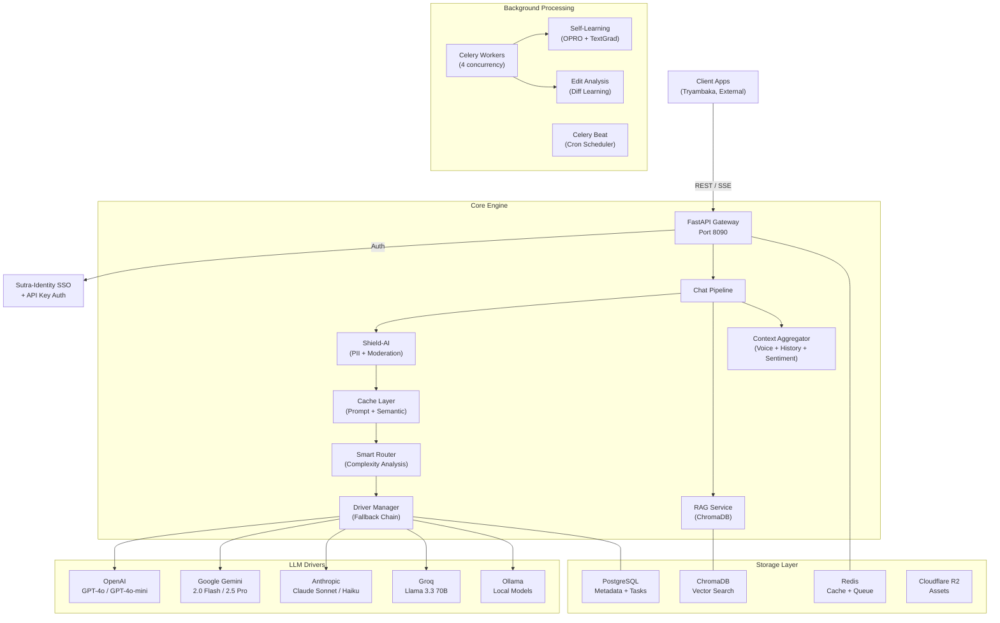
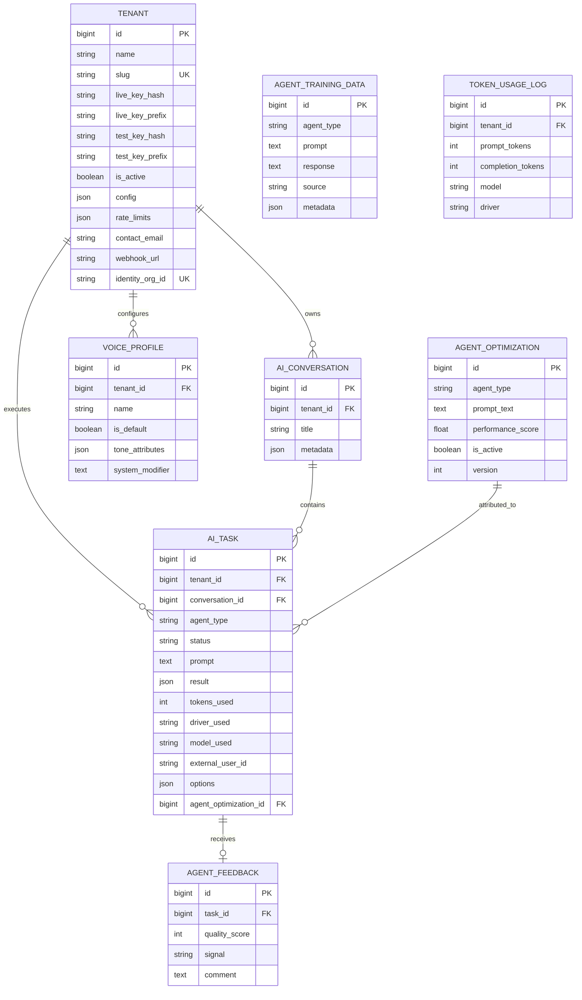
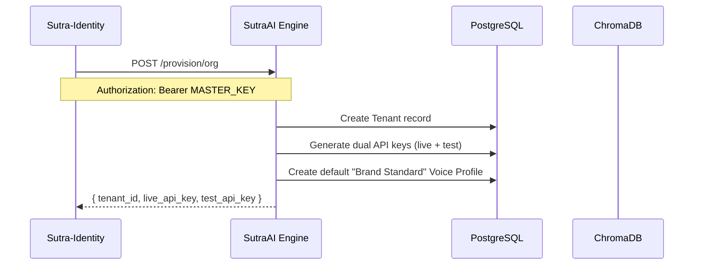
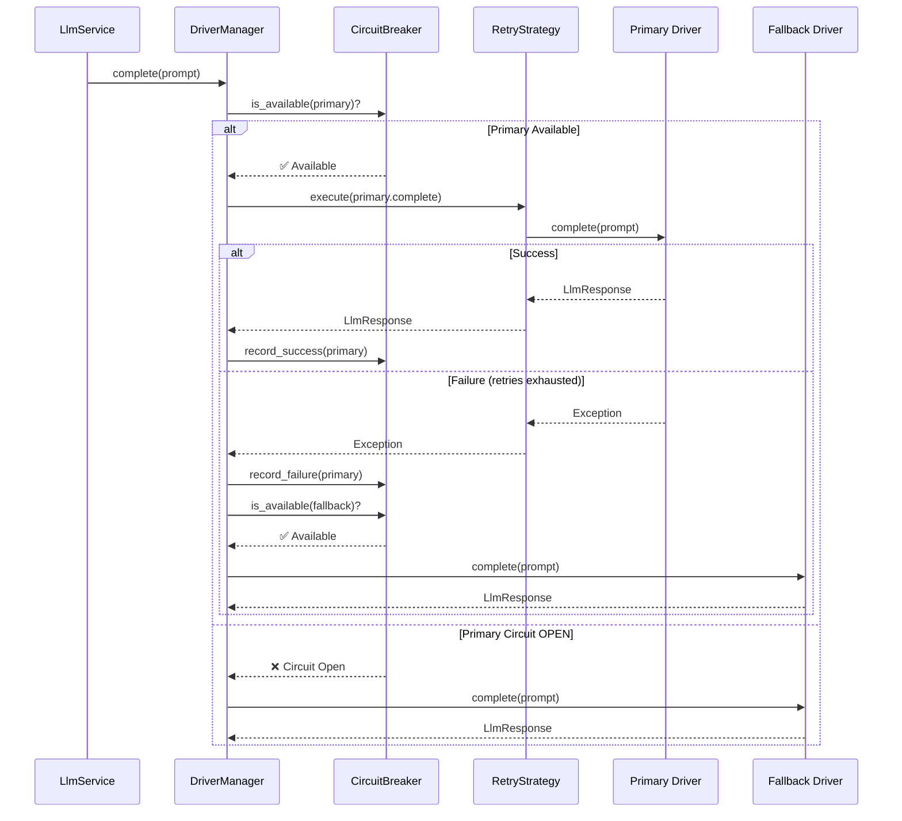
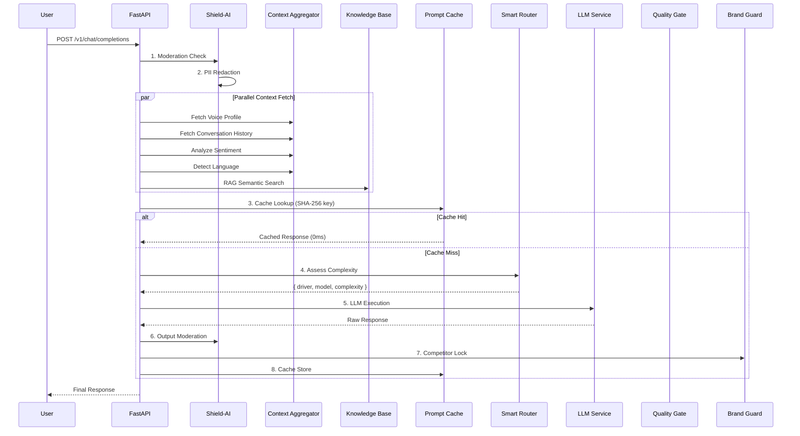
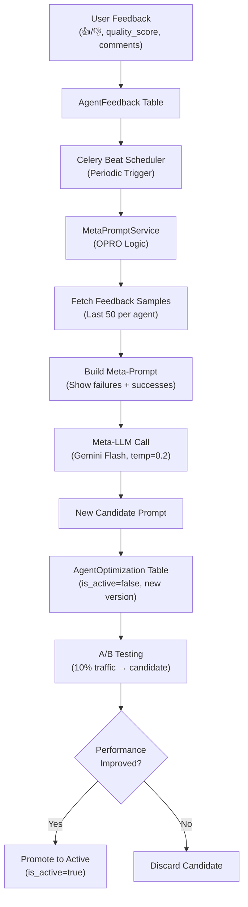

# SutraAI Engine — Developer Documentation

> **Version 0.1.0** · Standalone Multi-Tenant AI Microservice  
> Multi-Agent Orchestration · Self-Learning · Content Generation

---

## Table of Contents

1. [System Architecture](#1-system-architecture)
2. [Infrastructure & Services](#2-infrastructure--services)
3. [Database Schema](#3-database-schema)
4. [Authentication & Multi-Tenancy](#4-authentication--multi-tenancy)
5. [LLM Driver System](#5-llm-driver-system)
6. [Agent Architecture](#6-agent-architecture)
7. [Chat Pipeline Lifecycle](#7-chat-pipeline-lifecycle)
8. [Intelligence Layer](#8-intelligence-layer)
9. [RAG & Knowledge Base](#9-rag--knowledge-base)
10. [Self-Learning Engine](#10-self-learning-engine)
11. [Background Workers](#11-background-workers)
12. [API Reference](#12-api-reference)
13. [Configuration Reference](#13-configuration-reference)
14. [Developer Quickstart](#14-developer-quickstart)

---

## 1. System Architecture

The SutraAI Engine is a **high-performance, asynchronous micro-kernel** designed for multi-tenant AI operations. It follows the **Software Factory** pattern: every component is config-driven, interchangeable, and self-registering.

### Core Principles

- **Software Factory**: Components self-register from YAML configs. Adding a new agent = YAML + one-line class.
- **Driver Polymorphism**: Swap OpenAI → Gemini → Ollama with zero consumer changes.
- **Intelligence-First**: Every request passes through safety, caching, routing, and quality checks.
- **Self-Learning**: The engine continuously optimizes its own prompts based on user feedback via OPRO.

### High-Level Component Map



---

## 2. Infrastructure & Services

The engine runs as a set of containerized services orchestrated via Docker Compose / Podman Compose.

### Service Map

| Service | Container | Port (Host) | Port (Internal) | Purpose |
|---------|-----------|-------------|-----------------|---------|
| **API Server** | `sutra-ai-api` | `8090` | `8000` | FastAPI + Uvicorn (2 workers) |
| **Celery Worker** | `sutra-ai-worker` | — | — | Background task processing (4 concurrency) |
| **Celery Beat** | `sutra-ai-beat` | — | — | Scheduled cron jobs |
| **PostgreSQL** | `sutra-ai-postgres` | `5433` | `5432` | Primary database (v16 Alpine) |
| **Redis** | `sutra-ai-redis` | `6380` | `6379` | Cache, queue broker, token budgets |
| **ChromaDB** | `sutra-ai-chromadb` | `8100` | `8000` | Vector store for RAG + Semantic Cache |
| **Ollama** | `sutra-ai-ollama` | `11435` | `11434` | Local LLM (GPU profile only) |
| **Adminer** | `sutra-ai-adminer` | `8091` | `8080` | Database management UI |

### Network

All services communicate over a shared **bridge network** named `sutra-ai-network`. The API server volume-mounts `./app`, `./agent_config`, `./alembic`, and `./docs` for hot-reload during development.

---

## 3. Database Schema

The schema is designed for **multi-tenant isolation** and **full AI auditability**. Every AI call is logged as an `AiTask` with token usage, driver, model, and quality attribution.



### Key Design Decisions

- **Dual API Keys**: Each tenant has `sk_live_*` (production) and `sk_test_*` (sandbox) keys. Only the **hash** is stored.
- **Voice Profiles**: Each tenant can have multiple "voices" (e.g., "Professional Brand", "Casual Social"). The `system_modifier` is injected directly into the LLM system prompt.
- **Agent Optimization**: Versioned system prompts per agent. The `is_active` flag enables A/B testing (10% of traffic is routed to candidate prompts).
- **Full Audit Trail**: Every `AiTask` records which driver, model, and optimization version was used.

---

## 4. Authentication & Multi-Tenancy

### Authentication Modes

The engine supports two authentication mechanisms:

**1. API Keys (Service-to-Service)**
```
Authorization: Bearer sk_live_abc123...
```
- Keys follow the `sk_live_*` (production) or `sk_test_*` (sandbox) format.
- The engine hashes and matches the key against stored tenant records.
- Use `POST /provision/org` to generate keys for new tenants.

**2. SSO / JWT (Identity Federation)**
- Trusts JWT tokens from the `Sutra-Identity` issuer.
- Token payload must contain `org_id`.
- AI Engine maps this to the `identity_org_id` field in the tenants table.

### Tenant Provisioning Flow



```bash
# Provisioning call from Sutra-Identity
curl -X POST http://localhost:8090/provision/org \
  -H "Authorization: Bearer <MASTER_API_KEY>" \
  -H "Content-Type: application/json" \
  -d '{
    "identity_org_id": "global-org-123",
    "name": "Acme University",
    "slug": "acme-u",
    "contact_email": "admin@acme.edu"
  }'
```

---

## 5. LLM Driver System

The **DriverManager** is a Software Factory registry that resolves LLM provider implementations by name. It implements **automatic fallback chains**, **circuit breaking**, and **retry strategies**.

### Supported Drivers

| Driver | Provider | Models | Use Case |
|--------|----------|--------|----------|
| `openai` | OpenAI | GPT-4o, GPT-4o-mini | General purpose, vision, image generation |
| `gemini` | Google | Gemini 2.0 Flash, 2.5 Pro | Speed (Flash), deep reasoning (Pro) |
| `anthropic` | Anthropic | Claude Sonnet, Claude Haiku | Strategic content, long-form |
| `groq` | Groq | Llama 3.3 70B | Ultra-fast inference |
| `ollama` | Self-hosted | Llama 3.2, Mistral | Local/private, zero-cost |
| `mock` | Built-in | — | Testing and development |

### Execution Flow



### Circuit Breaker States

The CircuitBreaker tracks per-driver health with three states:

| State | Behavior | Transition |
|-------|----------|------------|
| **CLOSED** | All calls pass through (normal) | → OPEN after `N` consecutive failures (default: 3) |
| **OPEN** | All calls fail fast (driver is dead) | → HALF_OPEN after cooldown (default: 60s) |
| **HALF_OPEN** | One test call allowed | → CLOSED on success, → OPEN on failure |

### Standardized Response

All drivers return a unified `LlmResponse`:

```python
@dataclass
class LlmResponse:
    content: str           # The generated text
    raw_response: str      # Full provider response
    prompt_tokens: int     # Input token count
    completion_tokens: int # Output token count
    total_tokens: int      # Total tokens consumed
    model: str             # Model that was used
    driver: str            # Driver that was used
    metadata: dict         # Additional provider-specific data
```

---

## 6. Agent Architecture

Agents are **specialized AI workers** defined by YAML configurations. Each agent has a domain, response schema, and capabilities.

### Currently Registered Agents

| Agent | Identifier | Domain | Complexity |
|-------|-----------|--------|------------|
| **Copywriter** | `copywriter` | Headlines, body copy, CTAs, persuasive writing | Moderate |
| **SEO** | `seo` | Meta tags, keywords, content optimization | Complex |
| **Social Media** | `social_media` | Platform-optimized posts, hashtags, schedules | Moderate |
| **Email Campaign** | `email_campaign` | Newsletters, drip sequences, subject lines | Moderate |
| **WhatsApp** | `whatsapp` | Template messages, quick replies | Simple |
| **SMS** | `sms` | Short promotional and transactional messages | Simple |
| **Ad Creative** | `ad_creative` | Ad copy for Facebook, Google, LinkedIn | Simple |
| **Brand Auditor** | `brand_auditor` | Voice consistency, style guide adherence | Complex |
| **Content Repurposer** | `content_repurpose` | Multi-channel content adaptation | Moderate |

### Agent Hydration Lifecycle

1. **Config Loading**: Reads `agent_config/{identifier}.yaml` for domain, capabilities, and response schema.
2. **System Prompt Resolution** (3-tier fallback):
   - **A/B Test** (10% traffic): Tries an inactive `AgentOptimization` candidate prompt.
   - **Active Prompt**: Uses the latest `is_active=True` prompt from `agent_optimizations` table.
   - **YAML Fallback**: Falls back to the static system prompt from config.
3. **Context Aggregation**: Pulls Conversation History + Voice Profile + RAG results.
4. **Smart Routing**: Analyzes complexity and selects optimal driver/model tier.
5. **Execution**: Calls the LLM via the `LlmService`.

### YAML Configuration Format

```yaml
# agent_config/social_media.yaml
domain: "social media content strategy, platform-optimized posts, hashtags"

response_schema:
  - post_text
  - hashtags
  - best_time_to_post
  - platform_tips
  - character_count
  - image_prompt

capabilities:
  - Generate platform-optimized social media post copy
  - Create hashtag sets for maximum reach
  - Generate AI images via image_prompt field
  - Create content calendars and posting schedules

extra_instructions: |
  SOCIAL MEDIA SPECIFIC RULES:
  - ALWAYS include an "image_prompt" field in your JSON response.
  - The image_prompt should describe a visually compelling image.
```

### Adding a New Agent

```bash
# 1. Create YAML config
touch agent_config/my_agent.yaml

# 2. Create agent class
cat > app/services/agents/my_agent.py << 'EOF'
"""My Agent — description."""
from app.services.agents.base import BaseAgent

class MyAgent(BaseAgent):
    @property
    def identifier(self) -> str:
        return "my_agent"
EOF

# 3. Register in hub.py (add to _auto_register imports + list)
```

---

## 7. Chat Pipeline Lifecycle

The Chat Pipeline is the **high-performance execution core** for all AI interactions. Every user prompt passes through a multi-stage pipeline.



### Pipeline Stages Explained

| Stage | Component | Description |
|-------|-----------|-------------|
| **0.1** | `ModerationService` | Checks input against OpenAI's moderation API for safety violations |
| **0.2** | `PIIRedactor` | Regex-based masking of emails, phone numbers, credit cards before LLM |
| **1** | `ContextAggregator` | Parallel fetch: Voice Profile + History + Sentiment + Language |
| **1.5** | `KnowledgeBaseService` | RAG: semantic search against tenant's ChromaDB collection |
| **2** | `ContextPruner` | Compresses history to last 10 turns, converts to `{role, content}` format |
| **3** | `PromptCache` | Exact-match SHA-256 Redis cache (TTL: 2 hours). Hits ~15-25% of traffic |
| **4** | `SmartRouter` | Complexity scoring → model tier selection (saves 40-60% on tokens) |
| **5** | `LlmService` | Executes via `DriverManager` with fallback chain |
| **6** | `ModerationService` | Re-checks LLM output for safety violations |
| **7** | `CompetitorLock` | Removes competitor brand mentions from AI output |
| **8** | `PromptCache` | Stores result for future cache hits |

### Streaming Mode

When `stream=true`, the pipeline skips cache lookup and returns an `AsyncGenerator[str, None]` that yields text chunks via SSE (Server-Sent Events).

---

## 8. Intelligence Layer

The Intelligence Layer is the "brain" that surrounds every LLM call. It consists of 12+ subsystems.

### 8.1 Smart Router

Routes tasks to the optimal model tier based on **complexity scoring**. Saves 40-60% on token costs.

**Scoring Factors:**

| Factor | Simple (-1) | Complex (+2) |
|--------|------------|-------------|
| Word count | < 30 words | > 150 words |
| Keywords | "tweet", "quick", "caption" | "analyze", "strategy", "audit" |
| Agent default | SMS, WhatsApp, Ad Creative | SEO, EdTech |
| Structure | — | Numbered lists, multiple questions |

**Model Tier Mapping:**

| Driver | Simple | Moderate | Complex |
|--------|--------|----------|---------|
| OpenAI | GPT-4o-mini | GPT-4o-mini | GPT-4o |
| Gemini | 2.0 Flash | 2.0 Flash | 2.5 Pro Preview |
| Anthropic | Claude Haiku | Claude Sonnet | Claude Sonnet |
| Groq | Llama 3.3 70B | Llama 3.3 70B | Llama 3.3 70B |

### 8.2 Quality Gate

Multi-dimensional output scorer with **auto-regeneration**. Prevents low-quality responses from reaching the consumer.

**Scoring Dimensions:**

| Dimension | Weight | What it checks |
|-----------|--------|----------------|
| **Format** | 35% | Valid JSON structure when expected |
| **Completeness** | 30% | Coverage of expected response fields |
| **Coherence** | 20% | Absence of error-like phrases, repetition |
| **Length** | 15% | Sufficient response substance |

If `total_score < threshold` (default: 6/10), the Quality Gate augments the prompt with specific improvement instructions and retriggers the LLM.

### 8.3 Caching (Two-Tier)

**Tier 1 — Prompt Cache (Redis, Exact Match)**
- Key: `SHA-256(tenant_id + system_prompt + user_prompt + history)`
- Hit rate: ~15-25% of traffic
- TTL: 2 hours (configurable)
- Response time: **0ms**

**Tier 2 — Semantic Cache (ChromaDB, Vector Similarity)**
- Uses cosine similarity against embedded past prompts
- Catches paraphrased/reformulated prompts that exact-match misses
- Hit rate: ~5-15% of remaining traffic
- Similarity threshold: 0.92 (configurable)

### 8.4 Token Budget Manager

Per-tenant cost control via Redis counters.

```
Redis Key: sutra:budget:{tenant_id}:monthly:{YYYY-MM}:tokens
Redis Key: sutra:budget:{tenant_id}:monthly:{YYYY-MM}:cost
```

| Level | Threshold | Action |
|-------|-----------|--------|
| **ALLOW** | < 80% | Normal operation |
| **WARN** | 80-100% | Log warning, allow but flag |
| **BLOCK** | > 100% | Reject the request |

Includes per-model cost tables (e.g., GPT-4o input: $0.0025/1K tokens, Gemini Flash input: $0.0001/1K tokens).

### 8.5 Rate Limiter

Per-tenant request throttling. Default: 30 requests per minute.

### 8.6 Shield-AI (Safety Suite)

| Component | Purpose |
|-----------|---------|
| **PIIRedactor** | Regex-based: emails, phones, credit cards → `[REDACTED]` |
| **ModerationService** | OpenAI's free moderation API for content safety |
| **CompetitorLock** | Removes competitor brand mentions from AI output |
| **SentimentService** | Detects frustrated/angry users, triggers webhook alerts |
| **LanguageService** | Auto-detects user language, instructs LLM to respond natively |

### 8.7 Retry Strategy

Exponential backoff with configurable max retries (default: 2) and base delay (default: 1s).

---

## 9. RAG & Knowledge Base

The RAG (Retrieval-Augmented Generation) system gives each tenant a private knowledge base.

### Components

| File | Purpose |
|------|---------|
| `knowledge_base.py` | ChromaDB interface — `add_documents`, `query` per tenant |
| `document_processor.py` | Splits documents into embeddable chunks |
| `web_crawler.py` | Fetches and extracts text from web pages |
| `brand_extractor.py` | Extracts brand guidelines from crawled content |

### How RAG Works in the Pipeline

1. User sends a prompt.
2. `KnowledgeBaseService.query()` embeds the prompt and searches the tenant's ChromaDB collection.
3. Top 3 relevant chunks are injected into the system prompt under `[KNOWLEDGE BASE]`.
4. The LLM uses these facts when generating its response.

```python
# Tenant-specific collections in ChromaDB
collection_name = f"tenant_{tenant_id}_kb"
# Embedding model: OpenAI text-embedding-3-small
```

---

## 10. Self-Learning Engine

The engine **continuously improves its own prompts** based on user feedback, powered by OPRO (Optimization by PRompting).

### Learning Pipeline



### Key Components

| Component | File | Purpose |
|-----------|------|---------|
| **MetaPromptService** | `learning/meta_prompt.py` | Builds OPRO meta-prompts from feedback, calls meta-LLM |
| **PromptEvolution** | `learning/prompt_evolution.py` | Manages prompt versioning and promotion |
| **EditAnalyzer** | `learning/edit_analyzer.py` | Learns from user edits (diffs between AI output and user's final version) |
| **Evolution Job** | `workers/evolution_job.py` | Celery task that triggers periodic optimization |
| **Meta-Prompt Job** | `workers/meta_prompt_job.py` | Celery task that runs the OPRO cycle |
| **Edit Diff Job** | `workers/edit_diff_job.py` | Celery task that analyzes user edit patterns |

### A/B Testing Mechanics

- 10% of traffic is routed to a **candidate** prompt (`is_active=false`).
- The remaining 90% uses the **active** prompt (`is_active=true`).
- After sufficient feedback, the candidate is either promoted or discarded.
- The `agent_optimization_id` field on `AiTask` tracks which prompt version generated each response.

---

## 11. Background Workers

Celery workers handle all asynchronous processing. Redis serves as both broker (`redis://redis:6379/1`) and result backend (`redis://redis:6379/2`).

### Worker Configuration

| Config | Value |
|--------|-------|
| **Broker** | `redis://sutra-ai-redis:6379/1` |
| **Result Backend** | `redis://sutra-ai-redis:6379/2` |
| **Concurrency** | 4 workers |
| **Serialization** | JSON |

### Registered Tasks

| Task | Schedule | Description |
|------|----------|-------------|
| `evolution_job` | Daily | Triggers prompt optimization based on accumulated feedback |
| `meta_prompt_job` | On-demand | Runs the full OPRO cycle for a specific agent |
| `edit_diff_job` | On edit events | Analyzes user edits to learn preferences |
| `webhook_job` | On trigger | Sends frustration alerts to tenant webhook URL |
| `tasks.log_token_usage` | Per-call | Async logging of token consumption |

---

## 12. API Reference

### Health

| Method | Endpoint | Auth | Description |
|--------|----------|------|-------------|
| `GET` | `/health` | None | Liveness probe (always 200) |
| `GET` | `/ready` | None | Readiness probe (checks DB + Redis) |

### Chat

| Method | Endpoint | Auth | Description |
|--------|----------|------|-------------|
| `POST` | `/v1/chat/completions` | API Key | Send a chat prompt (sync or streaming) |

### Agents

| Method | Endpoint | Auth | Description |
|--------|----------|------|-------------|
| `GET` | `/v1/agents` | API Key | List all available agents with capabilities |
| `POST` | `/v1/agents/{type}/run` | API Key | Execute a single agent task |
| `POST` | `/v1/agents/batch` | API Key | Run multiple agents in parallel on the same prompt |

### Conversations

| Method | Endpoint | Auth | Description |
|--------|----------|------|-------------|
| `GET` | `/v1/conversations` | API Key | List conversations for the tenant |
| `POST` | `/v1/conversations` | API Key | Create a new conversation thread |
| `GET` | `/v1/conversations/{id}` | API Key | Get conversation with history |
| `POST` | `/v1/conversations/{id}/messages` | API Key | Send a message within a conversation |

### Tenants

| Method | Endpoint | Auth | Description |
|--------|----------|------|-------------|
| `GET` | `/v1/tenants/me` | API Key | Get current tenant info |
| `PATCH` | `/v1/tenants/me` | API Key | Update tenant config |
| `POST` | `/v1/tenants/me/rotate-key` | API Key | Rotate API keys (live or test) |

### Intelligence

| Method | Endpoint | Auth | Description |
|--------|----------|------|-------------|
| `GET` | `/v1/intelligence/status` | API Key | Get circuit breaker and cache status |

### RAG

| Method | Endpoint | Auth | Description |
|--------|----------|------|-------------|
| `POST` | `/v1/rag/documents` | API Key | Upload text documents to the knowledge base |
| `POST` | `/v1/rag/query` | API Key | Query the knowledge base directly |

### Provisioning

| Method | Endpoint | Auth | Description |
|--------|----------|------|-------------|
| `POST` | `/provision/org` | Master Key | Provision a new tenant (called by Identity service) |

### Billing

| Method | Endpoint | Auth | Description |
|--------|----------|------|-------------|
| `GET` | `/v1/billing/usage` | API Key | Get current period token usage and cost |

---

## 13. Configuration Reference

All configuration is managed via environment variables (`.env` file) with sensible defaults.

### Core Settings

| Variable | Default | Description |
|----------|---------|-------------|
| `APP_ENV` | `local` | Environment: local, staging, production |
| `DEBUG` | `true` | Enable Swagger UI at `/docs` and ReDoc at `/redoc` |
| `DATABASE_URL` | `postgresql+asyncpg://...` | Async PostgreSQL connection string |
| `REDIS_URL` | `redis://localhost:6379/0` | Redis connection for caching |
| `MASTER_API_KEY` | `sk_master_...` | Master key for provisioning endpoints |

### AI Driver Settings

| Variable | Default | Description |
|----------|---------|-------------|
| `AI_DRIVER` | `mock` | Primary LLM driver (`openai`, `gemini`, `anthropic`, `groq`, `ollama`, `mock`) |
| `AI_FALLBACK_DRIVER` | `gemini` | Automatic fallback if primary fails |
| `AI_VISION_DRIVER` | `gemini` | Driver for image analysis capabilities |
| `AI_IMAGE_DRIVER` | `openai` | Driver for image generation (DALL-E) |

### Intelligence Toggles

| Variable | Default | Description |
|----------|---------|-------------|
| `AI_SMART_ROUTER_ENABLED` | `true` | Enable complexity-based model selection |
| `AI_PROMPT_CACHE_ENABLED` | `true` | Enable exact-match Redis cache |
| `AI_PROMPT_CACHE_TTL` | `7200` | Cache TTL in seconds (2 hours) |
| `AI_SEMANTIC_CACHE_ENABLED` | `true` | Enable vector similarity cache |
| `AI_SEMANTIC_CACHE_THRESHOLD` | `0.83` | Similarity threshold (cosine) |
| `AI_QUALITY_GATE_ENABLED` | `true` | Enable quality scoring + auto-regeneration |
| `AI_QUALITY_GATE_THRESHOLD` | `6` | Minimum quality score (0-10) |
| `AI_CIRCUIT_BREAKER_THRESHOLD` | `3` | Failures before circuit opens |
| `AI_CIRCUIT_BREAKER_COOLDOWN` | `60` | Cooldown seconds before half-open |
| `AI_RATE_LIMIT_RPM` | `30` | Requests per minute per tenant |

### Self-Learning Settings

| Variable | Default | Description |
|----------|---------|-------------|
| `AI_AUTO_LEARNING_ENABLED` | `true` | Enable the self-learning pipeline |
| `AI_META_PROMPT_ENABLED` | `true` | Enable OPRO prompt optimization |
| `AI_META_PROMPT_MODEL` | `gemini-2.0-flash` | Model used by the meta-optimizer |
| `AI_META_PROMPT_THRESHOLD` | `20` | Min feedback items before optimization |
| `AI_EDIT_ANALYSIS` | `true` | Learn from user edits (diff analysis) |
| `AI_AB_TESTING` | `true` | Enable A/B testing of prompts |
| `AI_EXPLORE_RATE` | `0.2` | % of traffic routed to candidate prompts |

### Token Budget Settings

| Variable | Default | Description |
|----------|---------|-------------|
| `AI_TOKEN_BUDGET_ENABLED` | `true` | Enable per-tenant token budgets |
| `AI_TOKEN_BUDGET_MONTHLY` | `500000` | Default monthly token limit per tenant |

---

## 14. Developer Quickstart

### Prerequisites
- Docker / Podman with Compose plugin
- Git

### Setup
```bash
# 1. Clone
git clone https://github.com/sutracodehq-ui/sutra-ai-engine.git
cd sutra-ai-engine

# 2. Configure
cp .env.example .env
# Edit .env — set API keys for the providers you want to use

# 3. Start all services
podman compose up -d

# 4. Run database migrations
podman exec sutra-ai-api alembic upgrade head

# 5. Verify
curl http://localhost:8090/health
# → {"status":"ok","service":"sutra-ai"}

curl http://localhost:8090/ready
# → {"status":"ok","database":"connected","redis":"connected","chromadb":"unknown"}
```

### Access Points

| Resource | URL |
|----------|-----|
| **API Server** | http://localhost:8090 |
| **Swagger Docs** | http://localhost:8090/docs |
| **ReDoc Docs** | http://localhost:8090/redoc |
| **Developer Docs** | http://localhost:8090/docs/dev |
| **Adminer (DB UI)** | http://localhost:8091 |
| **ChromaDB** | http://localhost:8100 |

### Running the CLI

```bash
# Rotate API keys for a tenant
podman exec sutra-ai-api python -m app.scripts.rotate_key <slug> live
```

### Project Structure
```
sutracode-ai-engine/
├── agent_config/           # YAML configs for all AI agents
│   ├── copywriter.yaml
│   ├── seo.yaml
│   ├── social_media.yaml
│   ├── email_campaign.yaml
│   ├── whatsapp.yaml
│   ├── sms.yaml
│   ├── ad_creative.yaml
│   ├── brand_auditor.yaml
│   └── content_repurpose.yaml
├── app/
│   ├── main.py             # FastAPI entry point + app factory
│   ├── config.py           # Pydantic Settings (all env vars)
│   ├── dependencies.py     # FastAPI dependency injection
│   ├── api/
│   │   ├── health.py       # /health and /ready endpoints
│   │   └── v1/             # All v1 API routes
│   │       ├── router.py   # Route aggregator
│   │       ├── chat.py     # Chat completions API
│   │       ├── agents.py   # Agent listing + execution
│   │       ├── conversations.py
│   │       ├── tenants.py
│   │       ├── intelligence.py
│   │       ├── rag.py
│   │       ├── billing.py
│   │       └── provision.py
│   ├── models/             # SQLAlchemy ORM models
│   │   ├── tenant.py
│   │   ├── ai_conversation.py
│   │   ├── ai_task.py
│   │   ├── voice_profile.py
│   │   ├── agent_feedback.py
│   │   ├── agent_optimization.py
│   │   ├── agent_training_data.py
│   │   └── token_usage_log.py
│   ├── schemas/            # Pydantic request/response schemas
│   ├── services/
│   │   ├── agents/         # AI Agent classes + Hub
│   │   │   ├── base.py     # BaseAgent (config-driven, A/B testing)
│   │   │   ├── hub.py      # AiAgentHub (registry + orchestrator)
│   │   │   └── ...         # Individual agent classes
│   │   ├── chat/           # Chat Pipeline
│   │   │   ├── pipeline.py # Full execution pipeline
│   │   │   ├── engine.py   # Entry point (ChatEngine)
│   │   │   ├── aggregator.py # Parallel context fetch
│   │   │   └── pruner.py   # History compression
│   │   ├── drivers/        # LLM provider implementations
│   │   │   ├── base.py     # LlmDriver abstract + LlmResponse
│   │   │   ├── openai_driver.py
│   │   │   ├── gemini_driver.py
│   │   │   ├── anthropic_driver.py
│   │   │   ├── groq_driver.py
│   │   │   ├── ollama_driver.py
│   │   │   └── mock_driver.py
│   │   ├── intelligence/   # The Intelligence Layer
│   │   │   ├── smart_router.py     # Complexity-based model selection
│   │   │   ├── quality_gate.py     # Multi-dimensional output scoring
│   │   │   ├── circuit_breaker.py  # Per-driver health tracking
│   │   │   ├── retry_strategy.py   # Exponential backoff
│   │   │   ├── prompt_cache.py     # Redis exact-match cache
│   │   │   ├── semantic_cache.py   # ChromaDB vector cache
│   │   │   ├── rate_limiter.py     # Per-tenant throttling
│   │   │   ├── token_budget.py     # Monthly token budget enforcement
│   │   │   ├── pii_redactor.py     # PII masking (emails, phones)
│   │   │   ├── moderation.py       # Content safety (OpenAI API)
│   │   │   ├── competitor_lock.py  # Brand protection
│   │   │   ├── sentiment.py        # User sentiment analysis
│   │   │   ├── language.py         # Language auto-detection
│   │   │   ├── thinking.py         # Chain-of-thought wrapper
│   │   │   └── token_forecaster.py # Usage prediction
│   │   ├── learning/       # Self-Learning Engine
│   │   │   ├── meta_prompt.py      # OPRO optimizer
│   │   │   ├── prompt_evolution.py # Prompt version management
│   │   │   └── edit_analyzer.py    # Learn from user edits
│   │   ├── rag/            # RAG & Knowledge Base
│   │   │   ├── knowledge_base.py   # ChromaDB interface
│   │   │   ├── document_processor.py
│   │   │   ├── web_crawler.py
│   │   │   └── brand_extractor.py
│   │   ├── driver_manager.py  # LLM Factory + Fallback Chain
│   │   ├── llm_service.py    # Unified LLM interface
│   │   └── tenant_service.py # Tenant CRUD + key management
│   ├── workers/            # Celery tasks
│   └── scripts/            # CLI utilities
├── alembic/                # Database migrations
├── docker/
│   ├── Dockerfile          # API server image (multi-stage)
│   └── Dockerfile.worker   # Worker image
├── docs/                   # This documentation
├── docker-compose.yml
├── pyproject.toml
└── .env
```

---

*Contact: engineering@sutracode.app for API support.*
