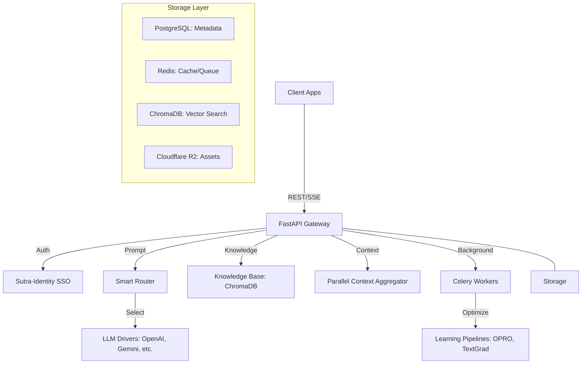
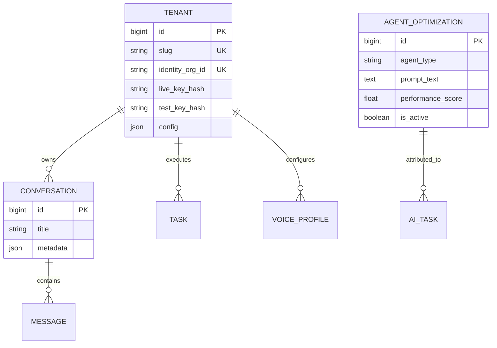
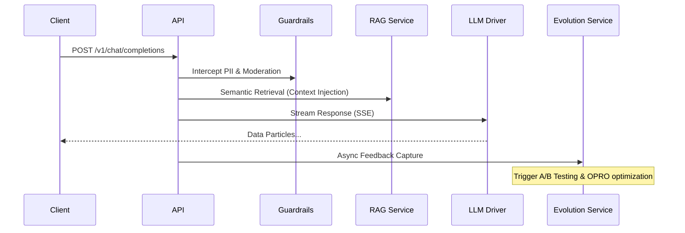

# SutraAI Engine: Developer Documentation

Welcome to the technical reference for the SutraAI Engine. This document covers the architecture, internal logic, and integration patterns for developers.

---

## 1. System Architecture
The SutraAI Engine is built as a high-performance, asynchronous micro-kernel designed for multi-tenant AI operations.

### High-Level Component Map


---

## 2. Database Structure
Our schema is designed for multi-tenant isolation and auditability.



---

## 3. Chat Request Lifecycle
This sequence diagram shows how a single user prompt is transformed into a high-quality AI response.



---

## 4. Agent Architecture (Specialized Logic)
Agents are defined by **YAML configurations** and **System Prompts**.

### How an Agent is Hydrated:
1. **Config Loading**: Reads `agent_config/{type}.yaml`.
2. **Context Aggregation**: Pulls current Conversation History + Tenant Voice Profile + RAG results.
3. **Smart Routing**: `SmartRouter` analyzes complexity and selects the optimal Model (e.g., GPT-4o for strategy, Gemini Flash for speed).
4. **Safety Wrap**: `PII_Redactor` and `CompetitorLock` filters are applied before LLM delivery.

### Currently Available Agents:
- `marketing`: High-conversion copywriting and strategy.
- `social_media`: Short, punchy engagement content.
- `edtech`: Pedagogical Socratic guidance (Phase 11).

---

## 5. Multi-Tenant Provisioning
Use our secure provisioning endpoint to onboard new organizations from your central identity server.

### Provisioning Flow:
```bash
# Call from Sutra-Identity
curl -X POST https://api.sutracode.app/v1/provision/org \
  -H "Authorization: Bearer <MASTER_KEY>" \
  -d '{
    "identity_org_id": "global-org-123",
    "name": "Acme University",
    "slug": "acme-u"
  }'
```
**Side Effects:**
- Creates a local `Tenant` record mapped to `identity_org_id`.
- Automatically generates a **"Brand Standard"** Voice Profile.
- Provisions a dedicated **ChromaDB collection** for their documents.

---

## 6. Authentication (SSO & Keys)
We support two modes of authentication:

1. **API Keys**: Standard `sk_live_...` or `sk_test_...` (Service-to-Service).
2. **SSO (JWT)**: We trust tokens from the `Sutra-Identity` issuer. 
   - Token must contain `org_id` in the payload.
   - AI Engine maps this to our `identity_org_id` field.

---

## 7. Developer Quickstart
### Environment Setup
1. Clone the repository.
2. `podman compose up -d`
3. Access Docs: `http://localhost:8090/docs/dev`


### Running the CLI
```bash
# Rotate keys for a tenant
podman exec sutra-ai-api python -m app.scripts.rotate_key <slug> live
```

---

*Contact: engineering@sutracode.app for API support.*
