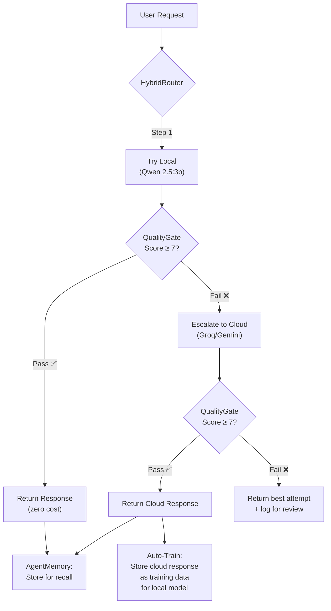

# Hybrid Intelligence Router — Implementation Plan

## Core Concept: Local-First, Cloud-Escalation, Auto-Train



**Result**: Every cloud response that beats local → automatically trains the local model to be smarter next time.

---

## Proposed Changes

### [NEW] `services/intelligence/hybrid_router.py`

The brain of the system. Replaces the simple `SmartRouter.route()` with:

```python
class HybridRouter:
    async def execute(prompt, system_prompt, agent_type, **opts) -> LlmResponse:
        # 1. Try local (Ollama/Qwen) first — zero cost
        local_response = await try_local(prompt, system_prompt)
        
        # 2. Quality-check the local response
        quality = quality_gate.score(local_response)
        
        if quality["passed"]:
            return local_response  # Free, fast, good enough
        
        # 3. Escalate to cloud (Groq → Gemini fallback)
        cloud_response = await try_cloud(prompt, system_prompt)
        
        # 4. Auto-train: store cloud's good response for local to learn from
        if cloud_quality["passed"]:
            await agent_memory.remember(agent_type, prompt, cloud_response.content)
            await training_collector.store_escalation(prompt, local_response, cloud_response)
        
        return cloud_response
```

**Key features:**
- **Local-first**: Every request hits Qwen 2.5:3b first (0 cost, ~200ms)
- **Quality-gated escalation**: Only escalates to cloud if local output scores < 7/10
- **Auto-training loop**: Cloud responses are stored in both ChromaDB (immediate recall) and JSONL (periodic fine-tune)
- **Per-agent quality tracking**: Tracks local success rate per agent — agents with high local scores skip the quality check entirely (fast path)

### [MODIFY] [base.py](file:///Users/piyushprashant/Documents/personal-projects/sutracode-ai-engine/app/services/agents/base.py)

Replace direct `LlmService.complete()` call with `HybridRouter.execute()`:
- [execute()](file:///Users/piyushprashant/Documents/personal-projects/sutracode-ai-engine/app/services/intelligence/retry_strategy.py#73-97) → `HybridRouter.execute()`
- Remove direct driver override — let the router decide

### [NEW] `services/intelligence/quality_tracker.py`

Lightweight Redis-backed tracker for per-agent local quality scores:
- Tracks rolling average of local quality scores per `agent_type`
- If average > 8.0 → **fast path** (skip quality gate, trust local)
- If average < 5.0 → **direct cloud** (don't waste time on local)
- Between 5-8 → **standard path** (try local → quality gate → maybe escalate)

### [MODIFY] [config.py](file:///Users/piyushprashant/Documents/personal-projects/sutracode-ai-engine/app/config.py)

Add config:
```python
ai_hybrid_routing: bool = True
ai_hybrid_quality_threshold: int = 7
ai_hybrid_fast_path_threshold: float = 8.0
ai_hybrid_direct_cloud_threshold: float = 5.0
```

---

## Verification Plan

1. Run quiz_generator with hybrid routing → verify local attempt + quality check
2. Force a low-quality local response → verify cloud escalation
3. Check ChromaDB memory after escalation → verify auto-training storage
4. Run same prompt again → verify local recall uses the cloud-trained example
